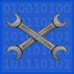

<p align="center"></p>

<h1><p align="center">Easy Data Fix</p></h1>

<p align="center">A library that enables modders to register custom data fixers.</p>

<div align="center">

[Download on Modrinth](https://modrinth.com/mod/easy-data-fix/versions) |
[Download from Releases](https://github.com/VoxelBill/easy-data-fix/releases)

</div>

## About The Project

**Easy Data Fix** is a small library mod that aids in creation of data fixers for mods, allowing custom mod game data to be converted between different versions of the game safly. The mod wraps the builtin DataFixerUpper classes which are as Mojang says "a set of utilities designed for incremental building, merging, and optimization of data transformations"

## Use

1. Download `easy_data_fix-<loader>-x.x.x+mc1.21` from on of the places at the top of this README.
2. Copy the downloaded jar file to your `mods` folder.

## Using The Library In Development

To setup data fixers for your mod you first need to add the library as a dependency in your build.gradle file, then you just need to register them on pre-launch using Easy Data Fix's API. See example below.

**build.gradle**
```groovy
repositories {
    mavenCentral()
    maven {
        name = "Modrinth"
        url = "https://api.modrinth.com/maven"
    }
}

dependencies {
    ...

    // Replace <Version> with the version number string from the Modrinth version page
    implementation "maven.modrinth:easy-data-fix:<Version>"
}
```

**ExampleFix.java**
```java
public class ExampleFix implements PreLaunchEntrypoint {
    @Override
    public void onPreLaunch() {
        DataFixerRegistry.addDataFix("Description of data fixer", builder -> {
            // dataVersion = The Minecraft data version used in the version your upgrading to.
            // SchemaVersion = The builtin schema class that goes with the data version.
            // Example: (4773, V4771::new) = 26.1 full release
            Schema schema = builder.addSchema(dataVersion, V[SchemaVersion]::new);
            builder.addFixer(BlockRenameFix.create(schema, "Fixer Name", DataFixerAPI.createRenamer("example_mod:mod_block", "example_mod:new_mod_block")));
            builder.addFixer(ItemRenameFix.create(schema, "Fixer Name", DataFixerAPI.createRenamer("example_mod:mod_item", "example_mod:new_mod_item")));
        });
        // You may also have multiple DataFixerRegistry here to better organize your data fixes or to support other versions.
    }
}
```

## Getting Started With Development

To get a local copy up and running, follow these simple steps.

### Prerequisites

Ensure you have the following installed on your machine:

* **Java Development Kit (JDK)**: Version 21 or higher.
  * [Download JDK](https://adoptium.net/)
* **Gradle**: Version 9.2 or higher.
  * [Install Gradle](https://gradle.org/install/)
* **Minecraft**: Version 1.21

### Build

1. **Clone the repository**
```sh
git clone https://github.com/VoxelBill/easy-data-fix.git
```

2. Navigate to the project directory
```sh
cd easy-data-fix
```

3. Build the project with Gradle
```sh
./gradlew clean build
```

You can find the built mod at `easy-data-fix/<loader>/build/libs/easy_data_fix-<loader>-x.x.x+mc1.21.jar`.
